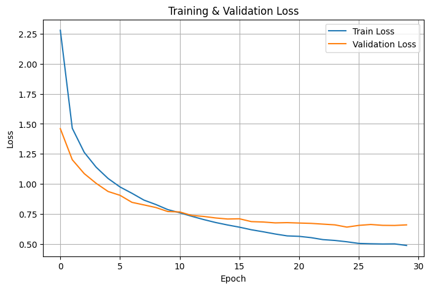
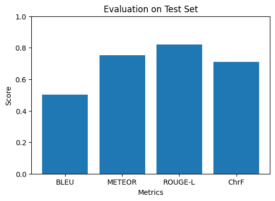

# Ứng dụng mô hình Transformer cho dịch máy Anh → Việt

## 1. Tóm tắt
Đề tài này áp dụng kiến trúc **Transformer** cho bài toán dịch máy Anh → Việt. 
Mô hình được fine-tune trên tập dữ liệu song ngữ và đánh giá theo bốn chỉ số chuẩn: **BLEU, METEOR, ROUGE-L, ChrF**. 
Kết quả huấn luyện được minh họa qua biểu đồ loss và các metric đánh giá.

---

## 2. Phương pháp
- **Mô hình:** Transformer Seq2Seq (Hugging Face Transformers).
- **Tiền xử lý:** Tokenizer, song song hoá dữ liệu.
- **Huấn luyện:** AdamW optimizer, cross-entropy loss, beam search khi sinh câu.
- **Đánh giá:** Dùng thư viện `evaluate` tính BLEU, METEOR, ROUGE-L, ChrF.

---

## 3. Kết quả

### Bảng đánh giá
| Chỉ số     | Giá trị |
|------------|---------|
| **BLEU**   | 0.5028 |
| **METEOR** | 0.7538 |
| **ROUGE-L**| 0.8220 |
| **ChrF**   | 0.7088 |

### Biểu đồ minh hoạ
#### Hình 1


#### Hình 2


---

## 4. Hướng dẫn chạy
1. Chuẩn bị dữ liệu:
   - `train.en` + `train.vi`
2. Cài đặt môi trường:
   ```bash
   python -m venv .venv
   source .venv/bin/activate   # hoặc .venv\Scripts\activate trên Windows
   pip install -r requirements.txt
   ```
3. Huấn luyện:
   ```bash
   python src/train.py --data_dir data --output_dir outputs/transformer-en-vi --epochs 3
   ```
4. Đánh giá:
   ```bash
   python src/evaluate.py --data_dir data --model_dir outputs/transformer-en-vi
   ```
5. Dịch thử:
   ```bash
   python src/translate.py --model_dir outputs/transformer-en-vi --sentence "This is a test."
   ```

---

## 5. Kết luận
- Transformer đạt kết quả khả quan với dữ liệu Anh–Việt.  
- Bốn chỉ số BLEU, METEOR, ROUGE-L, ChrF cho thấy chất lượng dịch ổn định.  
- Hướng mở rộng: tăng dữ liệu, thử mT5 hoặc Marian, tinh chỉnh tham số.

---

## 6. Tài liệu tham khảo
- Vaswani et al. (2017), *Attention Is All You Need*.  
- Hugging Face Transformers Documentation.
